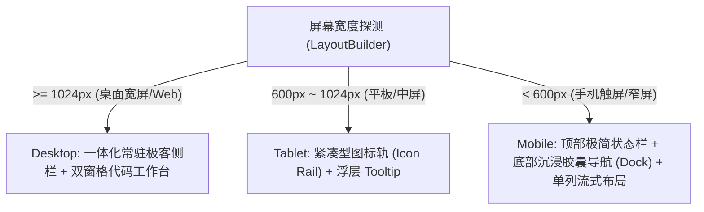

# Multiplatform Studio Design System (DESIGN.md)

本项目遵循 **Google Stitch** 与 **awesome-design-md** 规范，以全球顶级开发者生产力工具 **Raycast** 与 **Linear** 为设计标杆，专门为跨平台（Windows, macOS, Linux, Web, Android, iOS）量身定制一套极简、克制、兼具专业深度的极客工作台设计体系。

---

## 1. 核心设计哲学 (Design Philosophy)

1. **消除 AI 模板塑料感 (Anti-Generic AI Design)**：
   - 杜绝滥用无意义的大色块渐变与泛滥的弥散阴影；
   - 严禁对中文正文与标题套用负字间距（`letterSpacing < 0`），正文保持充裕行高（$\ge 1.4$）；
   - 拒绝在没有前后顺序的场景下添加虚假序号（如 `01 / 02 / 03`）；
   - 动效保持克制，仅对用户真实操作（切换、点击、校验反馈）产生响应。

2. **表面色彩阶梯替代重阴影 (Surface Color Ladder over Drop Shadows)**：
   - 界面纵深感完全通过纯色阶梯（Surface Ladder）和 1px 极细微边框（Hairline Border）构建，在暗黑与明亮模式下均保持纯净与清晰。

3. **专业代码工作台质感 (Code Workbench First)**：
   - 面向高频开发者场景，将纯文本框重塑为类似现代 IDE / 终端的代码窗体，标配状态指示灯、字数/行数统计与操作动作栏。

---

## 2. 色彩调色板与色彩阶梯 (Color Ladders & Tokens)

### 2.1 深空石墨暗黑体系 (Dark Studio - 核心首选)

| 色彩令牌 (Token) | 十六进制 (Hex) | 语义说明与应用场景 |
| :--- | :--- | :--- |
| `canvas` | `#07080A` | 底层全景画布底色，近乎纯黑的深邃石墨基底 |
| `surfaceBase` | `#0D0E11` | 一体化侧边栏与次级容器表面 |
| `surfaceCard` | `#121316` | 默认卡片、代码工作台窗格表面 |
| `surfaceElevated` | `#181A1F` | 悬浮卡片、输入获得焦点激活态表面 |
| `borderHairline` | `#24272E` | 1px 极细发光微边框，构建视窗骨架 |
| `borderHover` | `#383D48` | 悬停态高亮微边框 |
| `accentPrimary` | `#00D2B4` | 电光青（Electric Cyan），用于核心高亮与激活状态 |
| `accentSecondary` | `#6366F1` | 极客靛蓝（Indigo），辅助交互与次级激活 |
| `textPrimary` | `#F1F5F9` | 极高对比正文字体颜色 |
| `textSecondary` | `#94A3B8` | 副标题、注释与弱化说明文本 |
| `textMuted` | `#64748B` | 极淡提示与空态图标颜色 |
| `statusSuccess` | `#10B981` | 语法合法、校验通过翡翠绿 |
| `statusError` | `#EF4444` | 语法解析失败、异常警示红 |

### 2.2 润白高对比明亮体系 (Light Studio)

| 色彩令牌 (Token) | 十六进制 (Hex) | 语义说明与应用场景 |
| :--- | :--- | :--- |
| `canvas` | `#F8FAFC` | 极净冷灰白画布底色 |
| `surfaceBase` | `#FFFFFF` | 基础卡片与白底窗体 |
| `surfaceCard` | `#F1F5F9` | 侧栏底色与输入区域底色 |
| `surfaceElevated` | `#E2E8F0` | 交互悬停与高亮卡片 |
| `borderHairline` | `#E2E8F0` | 1px 浅灰冷色发光微边框 |
| `borderHover` | `#CBD5E1` | 悬停强化边框 |
| `accentPrimary` | `#0284C7` | 深邃科技青蓝 |
| `textPrimary` | `#0F172A` | 深石墨正文字色 |
| `textSecondary` | `#475569` | 次级文字 |
| `textMuted` | `#94A3B8` | 占位说明文字 |

---

## 3. 字阶比例与排版准则 (Typography Scale)

- **字体栈顺序**：`Inter, -apple-system, BlinkMacSystemFont, "Noto Sans SC", "PingFang SC", "Microsoft YaHei", sans-serif`
- **等宽代码字体**：`JetBrains Mono, Fira Code, Menlo, Monaco, Consolas, monospace`
- **字阶梯度**：
  - `Display / Hero`: `24sp`，字重 `FontWeight.w700`，行高 `1.2`
  - `Title Large`: `18sp`，字重 `FontWeight.w600`，行高 `1.3`
  - `Title Medium`: `15sp`，字重 `FontWeight.w600`，行高 `1.4`
  - `Body Regular`: `13sp`，字重 `FontWeight.w400`，行高 `1.6`
  - `Code / Mono`: `12.5sp`，字重 `FontWeight.w400`，行高 `1.5`，等宽排版
  - `Label / Badge`: `11sp`，字重 `FontWeight.w500`，微调胶囊边距

---

## 4. 三级全平台响应式断点 (Multiplatform Breakpoints)

---

## 5. 组件规范契约 (Component Contracts)

1. **`StudioCard`**：
   - 必须包含 `1px` 细发光边框（`borderHairline`）；
   - 圆角统一为 `12dp`（桌面）或 `10dp`（内嵌窗格）；
   - 严禁使用硬性投影，依靠 `surfaceCard` 与背景形成自然视觉反差。

2. **`CodeWorkbench`**：
   - 顶部标配：左侧拟 macOS 窗体状态三色小圆点或极简状态指示灯；中间窗格名称与行数/字符统计徽章；右侧动作快捷按钮（美化、压缩、复制、清空）；
   - 内容区：采用等宽字体与深层工作台底色，选中文本高亮可见。

3. **`AdaptiveSidebar`**：
   - 顶部品牌 Logo + 应用名称 + 版本胶囊；
   - 菜单项支持 Hover 渐变微光与激活态左侧青色发光胶囊标杆（Active Indicator）；
   - 底部固定系统环境快速入口。
