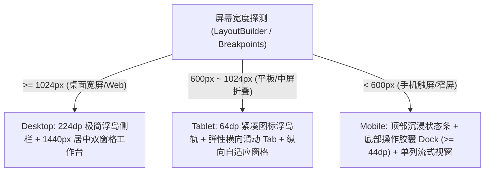

# Multiplatform Studio Design System (DESIGN.md)

本项目遵循 **Google Stitch** 与 **awesome-design-md** 规范，深度融合 **ui-ux-pro-max-skill** 与 **Anthropic frontend-design** 之核心美学精髓。以现代全球顶级开发者工具 **Linear 2.0**、**Vercel** 与 **Stripe** 为视觉标杆，在全平台（Windows, macOS, Linux, Web, Android, iOS）统一构建一套**默认现代极客明亮、电光青蓝点睛、极简浮岛侧栏、考究微高光陶瓷质感**的专业生产力工作台设计体系。

---

## 1. 核心设计哲学与反 AI 塑料感铁律 (Design Philosophy & Anti-AI-Slop)

1. **默认现代极客白优先 (Light-First Studio)**：
   - 告别灰暗、沉闷、压抑的大面积粗暴死黑（如 `#000000` 或 `#07080A`）；
   - 默认采用微点阵冷白底板（Canvas `#F8FAFC` 搭配 24px 极淡点阵网格）与纯白陶瓷容器（`#FFFFFF`），构建通透、清爽、充满现代科技质感的专业生产力环境；
   - 系统支持现代明亮（Light）与深度石墨暗黑（Modern Dark）无缝平滑切换，默认构建与初次加载一律为 **Light Mode**。

2. **消除 AI 模板塑料感 (Anti-Generic AI Design)**：
   - **杜绝廉价渐变与无意义大色块**：严禁随意套用粗制滥造的蓝紫高饱和渐变或大面积实心色块；
   - **陶瓷双层高光微边框替代重黑阴影**：界面纵深感完全由纯色阶梯、1px 浅灰微边框（`#E2E8F0`）、内侧顶部高光微切线（`inset 0 0 0 1px rgba(255,255,255,0.9)`）与极轻量环境微投影（`0 1px 2px rgba(15,23,42,0.04)`）共同构建；
   - **绝不容忍残缺与截断**：所有标签、导航、标题必须具备响应式弹性自适应机制，绝对杜绝文字溢出截断（如出现“JSON 格...”、“时间戳工...”等断头词）；
   - **大屏黄金比例约束**：宽屏桌面下内容区施加 `max-w-[1440px]` 居中约束，两侧留出呼吸留白，杜绝窗口被生硬拉扯成无神大色块。

3. **键盘优先理念 (Keyboard-First Experience)**：
   - 面向高频专业开发者，任何核心操作（搜索、运行、格式化、清空、侧栏折叠）必须配备显式快捷键胶囊（`KbdBadge`）与全局无障碍焦点环（Focus Ring）。

4. **意图明确与克制微动效 (Intentional Micro-interactions & Reduced Motion)**：
   - 动效时长严格标准化：微反馈 `100ms ~ 150ms`，容器展开与转场 `200ms ~ 250ms`，缓动统一采用 `Curves.easeOutCubic`；
   - **无障碍动效降级遵从**：当系统启用“减弱动态效果”（`MediaQuery.disableAnimationsOf(context) == true`）时，所有位移动效必须优雅退化为纯瞬时切换或纯透明度微变。

---

## 2. 全平台多端字体栈与排版基线系统 (Multiplatform Typography & StrutStyle)

### 2.1 分层跨端字体降级队列 (Cross-Platform Font Stack)

针对 Windows、macOS、Linux、Web 及移动端不同的字体渲染引擎（DirectWrite / CoreText / FreeType / CanvasKit），建立严格的字型降级队列：

- **正文与界面字体栈**：
  - **macOS / iOS**：`".SF Pro Text"`, `"PingFang SC"`, `"Helvetica Neue"`, `sans-serif`
  - **Windows**：`"Segoe UI"`, `"Microsoft YaHei"`, `"SimSun"`, `sans-serif`
  - **Linux / Android**：`"Roboto"`, `"Noto Sans SC"`, `"WenQuanYi Micro Hei"`, `sans-serif`
  - **Flutter 全局 Fallback**：`['Inter', 'PingFang SC', 'Microsoft YaHei', 'Noto Sans SC', 'sans-serif']`
- **等宽代码与数据字体栈**：
  - `"JetBrains Mono"`, `"Fira Code"`, `"Menlo"`, `"Monaco"`, `"Consolas"`, `monospace`

### 2.2 文本防削切与基线对齐保障 (StrutStyle Guard)

Flutter 在跨平台（尤其是桌面紧凑容器与 Web CanvasKit 渲染）时，因不同中文字体上行度（Ascent）与下行度（Descent）测量差异，容易导致中文笔画上下削顶削底。
- **全局基线均分**：全局排版必须配置 `TextLeadingDistribution.even`；
- **紧凑容器强制 StrutStyle**：在胶囊导航（`SegmentedButton`）、标签（`Badge`）、紧凑按钮（`Button`）等固定高度容器中，必须显式附加 `StrutStyle(forceStrutHeight: true, height: 1.3, leading: 0.1)` 确保文字垂直绝对居中且不被边缘截断。

### 2.3 桌面紧凑态 vs 移动触控态双态响应式字阶表

| 字阶角色 (Role) | 桌面端 (Desktop/Web $\ge 1024px$) | 移动端 (Touch $< 600px$) | 字重 (FontWeight) | 行高 (Height) | 语义说明 |
| :--- | :--- | :--- | :--- | :--- | :--- |
| `Display Hero` | `24sp` | `24sp` | `w700` (Bold) | `1.2` | 核心大标题与欢迎横幅 |
| `Title Large` | `18sp` | `18sp` | `w600` (SemiBold) | `1.3` | 模块主标题、工作台名称 |
| `Title Medium` | `16sp` | `16sp` | `w600` (SemiBold) | `1.4` | 卡片分段标题、弹窗标题 |
| `Body Regular` | `14.5sp` | `14.5sp` | `w400` (Regular) | `1.55` | 正文说明、表单内容 |
| `Code / Mono` | `14.0sp` | `14.0sp` | `w400` (Regular) | `1.6` (24dp) | 代码编辑器、时间戳、哈希值，舒展高可读 |
| `Label / Badge` | `13.0sp` | `13.0sp` | `w500` (Medium) | `1.3` | 快捷键徽章、状态指示胶囊 |

### 2.4 中文高阶排版四大不可逾越红线 (Chinese Typography Safeguards)

1. **绝对禁止负字间距**：汉字方块字绝不可使用西文字符的压缩算法，**严禁 `letterSpacing < 0`**；正文固定为 `0`，大标题允许微正向 `0.2`；
2. **严禁超粗黑体粘连**：中文标题字重上限严格控制在 `FontWeight.w600`，彻底杜绝 `w800/w900` 导致汉字复杂笔画糊成黑团；
3. **呼吸感行距底线**：正文字体行高必须维持充裕（`height >= 1.5`），代码区维持 `height: 1.6`（24dp）；
4. **数字与代码绝对等宽**：时间戳数值、Hash 摘要、十六进制代码必须绑定等宽字体族，确保多行数字纵向列绝对对齐。

---

## 3. 色彩调色板与语义设计令牌 (Color Ladders & Tokens)

### 3.1 现代净白工作台体系 (Light Studio - 默认首选)

以电光青蓝为核心灵魂，温润陶瓷白为基底，通过微弱的冷灰色彩阶梯建立高质感秩序：

| 语义令牌 (Token) | 十六进制 (Hex) | 语义与应用场景 |
| :--- | :--- | :--- |
| `canvas` | `#F8FAFC` | 底层全景画布底色，带 24px 点阵微纹理 |
| `surfaceBase` | `#FFFFFF` | 一级容器表面：主卡片、主内容板、陶瓷窗体 |
| `surfaceCard` | `#F1F5F9` | 次级容器表面：浮岛侧栏背景、输入窗体底色、编辑器未激活态 |
| `surfaceElevated` | `#FFFFFF` | 激活卡片、悬停高亮态，配以 `0 1px 2px rgba(15,23,42,0.04)` |
| `borderHairline` | `#E2E8F0` | 1px 极细发光微边框，视窗骨架基础线条 |
| `borderHover` | `#CBD5E1` | 悬停态、聚焦边框强化高亮线条 |
| `accentPrimary` | `#0284C7` | **电光青蓝 (Electric Azure)**，主交互、主行动按钮与高亮标杆 |
| `accentSecondary`| `#6366F1` | 极客靛蓝，用于辅助操作、次级徽标 |
| `textPrimary` | `#0F172A` | 极高对比度正文字色，沉稳深石墨 |
| `textSecondary` | `#475569` | 次级说明文案、字段标签、副标题 |
| `textMuted` | `#94A3B8` | 占位提示文案、未选中小图标、空状态说明 |
| `statusSuccess` | `#10B981` | 校验通过、格式化成功、正常在线运行翡翠绿 |
| `statusError` | `#EF4444` | 语法解析失败、格式错误、异常警示红 |
| `statusWarning` | `#F59E0B` | 提醒、耗时警告、版本变更琥珀金 |

### 3.2 现代深度石墨暗黑体系 (Modern Dark - 次级模式)

| 语义令牌 (Token) | 十六进制 (Hex) | 语义与应用场景 |
| :--- | :--- | :--- |
| `canvas` | `#0B0F17` | 深空石墨蓝黑底色，富有纵深感 |
| `surfaceBase` | `#111827` | 一级容器底色与主卡片背景 |
| `surfaceCard` | `#1E293B` | 次级卡片底色与编辑器窗体 |
| `surfaceElevated` | `#334155` | 悬浮高亮、选中项表面 |
| `borderHairline` | `#1F2937` | 1px 暗黑冷灰发光微边框 |
| `borderHover` | `#374151` | 悬停强化微边框 |
| `accentPrimary` | `#00D2B4` | 纯正电光青（Electric Cyan），暗黑模式下的醒目发光点 |
| `textPrimary` | `#F8FAFC` | 高可读正文字体白 |
| `textSecondary` | `#94A3B8` | 柔和次级说明文本 |
| `textMuted` | `#64748B` | 极淡辅助提示色 |

---

## 4. 核心组件规范契约 (Component Contracts)

### 4.1 极简浮岛侧栏 (Linear Island Sidebar) —— 导航规范

- **桌面宽屏 ($\ge 1024px$)**：
  - 宽度设定为 `224dp`，采用微毛玻璃与 1px 细微发光边框，与主内容区自然分离；
  - **菜单项视觉规范**：
    - 未选中态：文本色 `textSecondary`，鼠标悬停时平滑过渡至 `hover:bg-[#F1F5F9]`；
    - 选中激活态：采用 `accentPrimary.withOpacity(0.1)` 浅青蓝底 + `accentPrimary` 文本与前缀图标 + 右侧 `4dp` 实体青蓝状态点（Active Dot），拒绝大面积死黑或粗暴纯色实心块，呈现轻盈先锋感。
- **平板端中屏 ($600px \sim 1024px$)**：
  - 侧栏自适应折叠为 `64dp` 紧凑图标浮岛轨（Slim Icon Rail），居中展示图标并附带原生 Tooltip。
- **移动端小屏 ($< 600px$)**：
  - 侧栏自动隐入底部浮动胶囊（Dock）或侧滑抽屉，交互按钮保证 $\ge 44dp$ 无障碍触控热区。

### 4.2 陶瓷双窗格代码工作台 (Ceramic Code Workbench)

- **顶部窗体工具栏 (44dp)**：
  - 左侧：拟物 macOS 玻璃质感三色微控制灯（红/黄/绿带有垂直线性渐变与内微光）；
  - 中间：窗格标题 + 动态行数/字符数与合法性徽章（10px Monospace，柔和底色）；
  - 右侧：Ghost 辅助动作（示例数据、清空、复制结果）；
- **编辑器代码区**：
  - 标配 **独立行号槽轨 (Gutter)**，右对齐带 1px 浅灰细分割线；
  - 字体大小采用 **`13.5sp` JetBrains Mono**，行高舒展至 **`1.6` (24dp)**；
  - 微语法彩色高亮：Key 为科技蓝、String 为翡翠绿、Boolean 为琥珀橙、括号为中性灰；
- **底栏触觉按键组 (Tactile Actions)**：
  - 主要动作（美化格式化）：采用电光青蓝触觉按钮（`btn-azure-primary`），带顶部 1px 细高光与立体阴影；
  - 次要动作（紧凑压缩）：纯白底微立体边框按钮（`btn-secondary`）。

### 4.3 操作看板与系统设置契约

- **操作看板 (Live Activity)**：
  - 顶部标配 3 张自适应指标卡（总频次、格式化占比、时间戳占比），内嵌微图标；
  - 下方卡片式历史流水时间轴，支持耗时状态指示与“一键回填工坊”数据反向灌入。
- **系统设置 (Preferences)**：
  - 明暗主题三选一卡片（明亮默认高亮、暗黑、跟随系统）；
  - 种子强调色切换盘；
  - 宿主平台运行时感知卡片（展示 Web/Windows、渲染引擎与基线参数）。

---

## 5. 三级全平台多端响应式断点与布局形态 (Responsive Layouts)

### 5.1 桌面端布局规范 (Desktop $\ge 1024px$)
- 侧边栏：宽度 `224dp`，浮岛毛玻璃；
- 主工作台：左右双窗格排版，中缝 `16dp`，最大宽度约束 `1440px`，高度自适应填满视口。

### 5.2 平板端布局规范 (Tablet $600px \sim 1024px$)
- 侧边栏自动折叠为 `64dp` 紧凑图标轨；
- 顶部 Tab 栏支持平滑横向滑动，双窗格根据可用高度自适应堆叠展示。

### 5.3 移动端布局规范 (Mobile $< 600px$)
- 隐藏常驻侧栏，转为抽屉式导航或底部沉浸悬浮 Dock；
- 单列纵向流式排版，所有可交互按钮高度满足 $\ge 44dp$ 无障碍触控热区。
