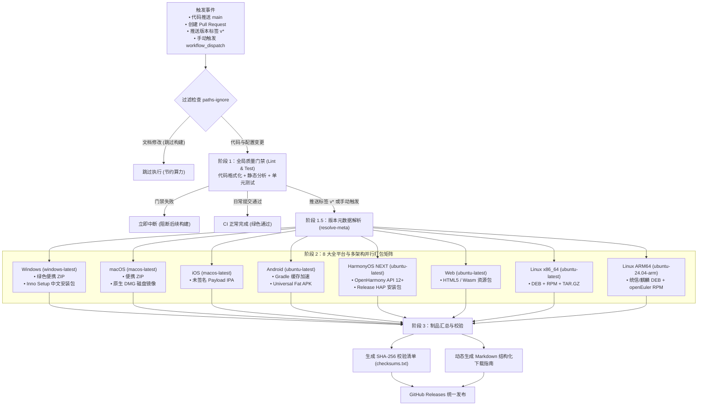

# Ateng-Flutter: Flutter 跨平台演示与 GitHub Actions 全平台自动化打包发布

[](https://github.com/atengk/Ateng-Flutter/actions/workflows/pipeline.yml)
[](https://github.com/atengk/Ateng-Flutter/releases)
[](https://atengk.github.io/Ateng-Flutter/)
[](https://flutter.dev)
[](LICENSE)

本项目是一个基于 **Flutter & Dart** 构建的工业级跨平台演示工程，深度融合 **GitHub Actions** 全平台自动化 CI/CD 流水线，实现日常提交快速质量门禁，以及版本标签推送时**全自动多平台编译、标准向导安装包封装、校验哈希生成与 GitHub Releases 制品分发**。

> 🌐 **Web 在线演示体验 (GitHub Pages)**：[https://atengk.github.io/Ateng-Flutter/](https://atengk.github.io/Ateng-Flutter/)

---

## 核心业务与现代极客工作台特性 (Modern Light Studio)

本项目不仅是一套全自动化流水线脚手架，更是严格依循 [DESIGN.md](DESIGN.md) 顶级设计宪章构建的**现代极客跨平台微工具工坊**：

### 🎨 先锋美学与自适应导航系统
- **现代极客白基底 (Light-First Studio)**：告别灰暗粗暴死黑，默认采用温润冷白底板（`#F8FAFC`）与纯白陶瓷容器（`#FFFFFF`），兼顾深度石墨暗黑模式；
- **电光青蓝品牌色 (Electric Azure `#0284C7`)**：以深邃先锋科技青蓝作为核心交互高光，搭配双层发光微边框（外灰线 + 内顶白高光）；
- **极简浮岛侧栏 (Linear Island Sidebar)**：
  - **桌面端 ($\ge 1024px$)**：`224dp` 独立悬浮岛侧栏，配备右侧实体青蓝活跃指示点与浅青蓝柔底，主视窗施加 `1440px` 黄金居中留白约束；
  - **平板端 ($600px \sim 1024px$)**：自适应收起为 `64dp` 紧凑图标浮岛轨，Tab 栏平滑横向滚动；
  - **移动端 ($< 600px$)**：常驻侧栏隐入底部沉浸浮动 Dock，触控热区严格保障 $\ge 44dp$；
- **排版四大红线与防剪裁**：汉字方块字绝无负字距、字重克制（上限 `w600`）、充裕呼吸感行高（$\ge 1.5$）、数字与代码绝对等宽；全面配备 `StrutStyle` 契约，彻底根除多端中文字画削切与截断。

### 🛠️ 三大核心功能模块
1. **微工具工坊 (Toolbox Studio)**：
   - **双窗格陶瓷代码工作台**：标配 **独立行号槽轨 (Gutter)**、`13.5sp` JetBrains Mono 等宽字体栈与 `24dp` (1.6) 行高对齐，滚动控制器零延迟严格双向联动，支持长行横向平滑滚动；
   - **JSON 工具**：支持实时语法有效性校验、一键美化格式化、紧凑压缩与错误堆栈精准定位；
   - **Unix 时间戳**：秒级与毫秒级实时跳动时钟、时间戳与格式化时间双向转换、一键快捷复制；
   - **密码学与编解码**：支持 MD5、SHA-256 哈希散列计算，以及 Base64 / URL 双向编解码。
2. **操作看板 (Activity & History)**：
   - **3 栏高奢陶瓷指标卡**：实时统计累计操作频次、JSON 格式化占比与时间戳/编解码频次；
   - **不可变操作流水清单**：内置带有 `IN`/`OUT` 标识的代码预览块与毫秒级执行耗时徽章；
   - **数据反向回填**：支持从流水历史一键“回填工坊”，实现历史上下文即时重放。
3. **系统设置 (Settings & Preferences)**：
   - **外观色彩模式三选一卡片**：「明亮极客 (Light)」、「深邃暗黑 (Dark)」、「跟随系统 (System)」视觉卡片选择器；
   - **工作台强调色调色盘**：内置多款精选种子色，一键动态派生 Material 3 全局色彩主题；
   - **运行时环境感知**：实时感知当前宿主操作系统（Web/Windows/macOS/Linux/Android/iOS）、视窗分辨率、设备物理像素比 (DPR) 与无障碍动效降级状态。

---

## 平台支持矩阵与制品清单 (全架构覆盖)

流水线采用工业级标准命名规范（`[应用名]_[版本号]_[平台]_[架构].[扩展名]`），单次发版全自动产出 **14 个标准制品**：

| 操作系统 / 生态 | 架构 | 规范化安装包 / 制品文件名 | 格式 | 遵循标准与特性说明 |
| :--- | :--- | :--- | :---: | :--- |
| 💻 **Windows** | `x64` | `Ateng-Flutter_1.0.5_windows_x64_setup.exe`<br>`Ateng-Flutter_1.0.5_windows_x64_portable.zip` | `.exe`<br>`.zip` | **Inno Setup 原生简体中文安装向导** (含开始菜单、桌面图标与卸载器)<br>免安装便携绿色包 (支持 Win11 ARM 转译运行) |
| 🍎 **macOS** | Universal | `Ateng-Flutter_1.0.5_macos_universal.dmg`<br>`Ateng-Flutter_1.0.5_macos_universal.zip` | `.dmg`<br>`.zip` | **标准挂载磁盘安装镜像** (含拖拽至 Applications 原生安装)<br>通用双架构 App Bundle 绿色包 (M 芯片与 Intel 原生即开) |
| 📱 **iOS** | `arm64` | `Ateng-Flutter_1.0.5_ios_arm64.ipa` | `.ipa` | 标准未签名测试安装包 (支持 TrollStore / AltStore / 企业自签) |
| 🤖 **Android** | Universal | `Ateng-Flutter_1.0.5_android_universal.apk` | `.apk` | 生产环境 Release APK 胖包 (内置 ARMv7/ARM64/x86 全部原生库) |
| 📱 **HarmonyOS NEXT** | `arm64` | `Ateng-Flutter_1.0.5_harmonyos_arm64.hap` | `.hap` | **纯血鸿蒙 / OpenHarmony 标准安装包** (未签名测试包，支持真机/模拟器测试) |
| 🌐 **Web** | Web | `Ateng-Flutter_1.0.5_web.zip` | `.zip` | 包含静态 HTML/JS/Wasm 资源的网站整包 (可直接部署至 Pages/Nginx) |
| 🐧 **Linux (传统 PC/服务器)** | `x86_64` | `Ateng-Flutter_1.0.5_linux_amd64.deb`<br>`Ateng-Flutter-1.0.5-1.x86_64.rpm`<br>`Ateng-Flutter_1.0.5_linux_x86_64_portable.tar.gz` | `.deb`<br>`.rpm`<br>`.tar.gz` | 遵循 **Debian 官方规范** (`_amd64.deb`)，适配 Ubuntu/Debian/Deepin<br>遵循 **RedHat 官方规范** (`-1.x86_64.rpm`)，适配 RHEL/CentOS/Fedora<br>便携运行包 (保留 `0755` 权限) |
| 🐉 **Linux (国产信创/树莓派)** | `arm64` | `Ateng-Flutter_1.0.5_linux_arm64.deb`<br>`Ateng-Flutter-1.0.5-1.aarch64.rpm`<br>`Ateng-Flutter_1.0.5_linux_arm64_portable.tar.gz` | `.deb`<br>`.rpm`<br>`.tar.gz` | 专为**统信 UOS / 银河麒麟** ARM64 信创桌面设计的标准安装包<br>专为 **openEuler / RedHat ARM** 信创服务器设计的 RPM 安装包<br>树莓派/单板机运行包 |

---

## 自动化流水线架构 (`pipeline.yml`)

项目已全面重构为单一高内聚流水线，包含并发防抖、文档提交过滤、Gradle 缓存加速与全自动哈希校验。



---

## 产物完整性校验 (SHA-256 Checksums)

每个 Release 发行版均附带 `checksums.txt`，供用户核对下载文件的完整性与真实性：

- **Linux / macOS 终端**：
  ```bash
  sha256sum -c checksums.txt
  ```
- **Windows PowerShell**：
  ```powershell
  Get-FileHash <文件名> -Algorithm SHA256
  ```

---

## 本地开发与运行指南

如本地已安装 Flutter SDK (3.x+)：

```bash
# 1. 获取依赖
flutter pub get

# 2. 代码格式化检查与静态分析
dart format --output=none --set-exit-if-changed .
flutter analyze

# 3. 运行单元与 Widget 冒烟测试
flutter test

# 4. 本地启动运行 (自动检测目标设备)
flutter run
```

---

## 规范指引
- UI/UX 设计系统与多端交互规范详见 [DESIGN.md](DESIGN.md)。
- 项目专有 AI Agent 协同与开发规范详见 [AGENTS.md](AGENTS.md)。
